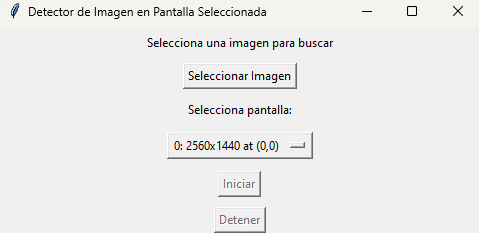

# 🖱️ Image Clicker App

Una pequeña aplicación de escritorio que busca una imagen en una pantalla seleccionada y hace clic automáticamente cuando la detecta.

## 🚀 Características

- Interfaz gráfica con `tkinter`.
- Selección de pantalla para escanear.
- Clic automático sobre coincidencias de imagen usando `pyautogui` y `OpenCV`.

## 📦 Requisitos

- Windows 10 u 11
- Python 3.8+ (solo si compilas desde código)

## ⬇️ Descargar el ejecutable (.exe)

Haz clic aquí para descargar la versión lista para usar:

👉 [Descargar ImageClicker.exe]([https://github.com/ramzeta/image-clicker/releases/latest/download/ImageClicker.exe ](https://github.com/ramzeta/sistema-imagenes-autoclick/blob/main/dist/ImageClicker.exe))

> No necesitas instalar Python ni nada adicional.

## 🛠 Instalación manual (desde código fuente)

1. Clona este repositorio o copia los archivos:

   ```bash
   git clone https://github.com/tu_usuario/image_clicker_app.git
   cd image_clicker_app
   ```

2. Crea y activa un entorno virtual:

   - En **Windows**:

     ```bash
     python -m venv venv
     venv\Scripts\activate
     ```

   - En **Linux/macOS**:

     ```bash
     python3 -m venv venv
     source venv/bin/activate
     ```

3. Instala las dependencias:

   ```bash
   pip install -r requirements.txt
   ```

4. Ejecuta la app:

   ```bash
   python image_clicker/main.py
   ```

## 🧪 Test Rápido

1. Ejecuta la app.
2. Selecciona una imagen.
3. Elige la pantalla donde buscarla.
4. Pulsa "Iniciar" y observa los clics automáticos cuando se detecte la imagen.

## 🖼️ Vista previa



## ☕ ¿Te gusta mi trabajo?

Puedes apoyarme con una donación:

[](https://paypal.me/rapere)

También puedes escanear este código QR desde tu móvil:

<p align="center">
  
</p>

## 📄 Licencia

MIT © Rami

---

# 🧠 Etiquetas

`sistema-imagenes-autoclick` `desktop-app` `pyautogui` `opencv-python` `tkinter` `automation` `image-detection`
