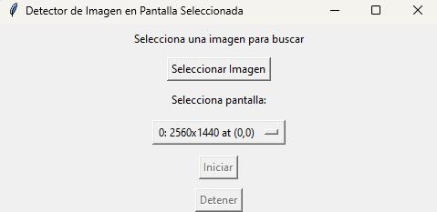

# 🖱️ Image Clicker App - Versión Multi-Pantalla

Una aplicación de escritorio avanzada que busca **múltiples imágenes** en **todas las pantallas simultáneamente** y hace clic automáticamente cuando las detecta.

## 🆕 Nuevas Características v3.0

- 🖥️ **Análisis Multi-Pantalla**: Monitorea TODAS las pantallas al mismo tiempo
- 🎯 **Detección Múltiple**: Carga varias imágenes para buscar simultáneamente  
- 🔍 **Identificación Precisa**: Muestra qué imagen fue detectada y en qué monitor
- 🖱️ **Movimiento Inteligente**: El cursor se mueve automáticamente después del click
- 🧵 **Multi-Threading**: Hilos independientes para cada monitor
- 📊 **Logs Detallados**: Seguimiento en tiempo real con identificación de monitor
- 🎨 **Interfaz Avanzada**: Mejor organización y control de configuración

## 🚀 Características

- Interfaz gráfica moderna con `tkinter`
- **Análisis simultáneo** de todas las pantallas conectadas
- **Detección múltiple** de imágenes simultáneas
- **Identificación automática** de qué imagen fue detectada y en qué monitor
- **Multi-threading** con hilos independientes por monitor
- **Movimiento inteligente del cursor** para evitar interferencias
- **Logs detallados** con timestamps e identificación de monitor
- Selección flexible: todas las pantallas o monitor específico
- Clic automático preciso usando `pyautogui` y `OpenCV`
- Compilación a ejecutable independiente

## 📦 Requisitos

- Windows 10 u 11
- Python 3.8+ (solo si compilas desde código)

## ⬇️ Descargar el ejecutable (.exe)

Haz clic aquí para descargar la versión lista para usar:

👉 [Descargar ImageClicker.exe](https://github.com/ramzeta/sistema-imagenes-autoclick/blob/main/releases/ImageClicker.exe)

> **Instrucciones de descarga:**
> 1. Haz clic en el enlace de arriba
> 2. En la página de GitHub, haz clic en "Download" (o "Descargar")
> 3. Ejecuta el archivo descargado
> 
> **Nota:** No necesitas instalar Python ni nada adicional. El ejecutable incluye todo lo necesario.

## � Información del Ejecutable

- **Tamaño:** ~120 MB (incluye todas las librerías necesarias)
- **Compatibilidad:** Windows 10/11 (64-bit)
- **Sin instalación:** Archivo portable, simplemente ejecuta
- **Antivirus:** Puede ser detectado como falso positivo por algunos antivirus (es normal en ejecutables de Python compilados)

## �🛠 Instalación manual (desde código fuente)

1. Clona este repositorio o copia los archivos:

   ```bash
   git clone https://github.com/tu_usuario/image_clicker_app.git
   cd image_clicker_app
   ```

2. Crea y activa un entorno virtual:

   - En **Windows**:

     ```bash
     python -m venv venv
     venv\Scripts\activate
     ```

   - En **Linux/macOS**:

     ```bash
     python3 -m venv venv
     source venv/bin/activate
     ```

3. Instala las dependencias:

   ```bash
   pip install -r requirements.txt
   ```

4. Ejecuta la app:

   ```bash
   python image_clicker/main.py
   ```

## 🧪 Test Rápido

1. Ejecuta la app con `test.bat` o `python image_clicker/main.py`
2. Haz click en "Agregar Imágenes" y selecciona una o varias imágenes
3. Deja seleccionado "Todas las pantallas" (recomendado) o elige monitor específico
4. Pulsa "Iniciar Detección" y observa los logs por monitor
5. El sistema creará hilos para cada pantalla y hará clicks automáticos
6. Observa cómo se identifica en qué monitor ocurrió cada detección

## 🖼️ Vista previa



## ☕ ¿Te gusta mi trabajo?

Puedes apoyarme con una donación:

[](https://paypal.me/rapere)

También puedes escanear este código QR desde tu móvil:

<p align="center">
  
</p>

## 📄 Licencia

MIT © Rami

---

# 🧠 Etiquetas

`sistema-imagenes-autoclick` `desktop-app` `pyautogui` `opencv-python` `tkinter` `automation` `image-detection`
